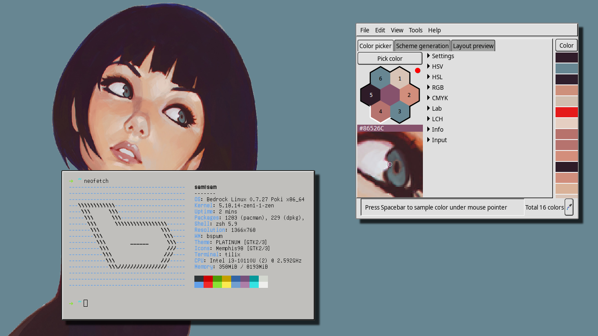
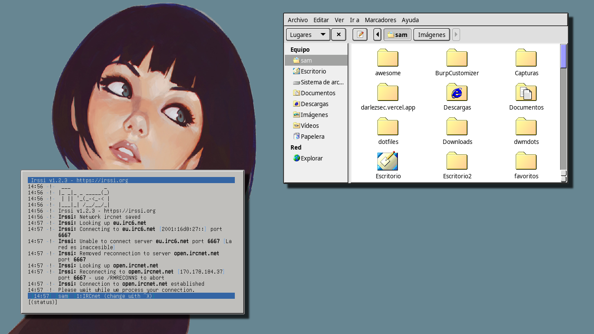

# [BSPWM] Rice Cool 90's sense

### Details:

- [x] OS: Bedrock Linux 0.7.27 Poki x86_64
- [x] WM: [BSPWM]()
- [x] Compositor: [Ibhagwan's Picom Fork](https://github.com/ibhagwan/picom)
- [x] Terminal: [Tilix](https://gnunn1.github.io/tilix-web/)
- [x] Icons: 
- [x] Theme: [PLATIUM](https://www.gnome-look.org/p/1014636/)
- [x] Wallpaper: [Unsplash](https://unsplash.com/photos/Ld-YP_iBGyI)

